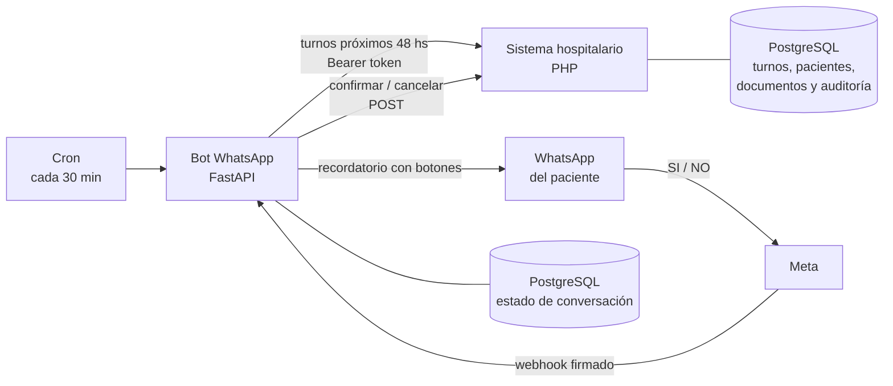

# SGH · Sistema de Gestión Hospitalaria + Bot de WhatsApp

Sistema web para un hospital público, con un bot de WhatsApp que confirma turnos
automáticamente · PHP · FastAPI · PostgreSQL · Docker

Proyecto en equipo · Prácticas Profesionalizantes III · ISFT N° 177 · 2026

El código fuente está en repositorios privados. Disponible para revisión.

---

## Qué problema resuelve
Muchos pacientes no asisten a sus turnos quirúrgicos y nadie se entera hasta ese
día. El sistema le avisa al paciente por WhatsApp 48 hs antes, el paciente
responde **SI** o **NO**, y el turno queda confirmado o cancelado en el sistema
del hospital, sin intervención de la secretaría.

El sistema hospitalario, además, gestiona el circuito quirúrgico (admisión,
agenda prequirúrgica, cupos, órdenes, seguimiento), la digitalización de
documentos y los usuarios con permisos por rol.

## Mi rol
+150 commits en un equipo de más de 10 personas, trabajando por tickets de Jira en dos módulos y en el bot.

**Bot de WhatsApp (backend completo)**
- Desarrollé el bot desde el setup inicial: FastAPI, Docker y PostgreSQL.
- Implementé el flujo de recordatorios con **botones interactivos SI/NO** y el
  procesamiento de respuestas por webhook.
- Validé la **firma `X-Hub-Signature-256`** de Meta para rechazar webhooks falsos.
- Até la identificación del paciente por DNI al teléfono que escribe, para que
  nadie pueda confirmar o cancelar turnos ajenos.
- Normalicé y validé teléfonos, y evité ofrecer turnos cancelados o ya confirmados.
- Guardé las conversaciones y las mostré en el panel del hospital.
- Escribí tests de integración del flujo de turnos y preparé el deploy en la VPS.

**Módulo de Digitalización de documentos**
- Construí desde cero la **API de carga de documentos**: solo acepta POST, valida
  el acceso, admite únicamente PDF, JPG y PNG, controla el tamaño máximo, genera
  un nombre único, guarda el archivo y registra el documento en la base, con
  respuestas JSON estandarizadas y manejo de errores en cada paso.
- Desarrollé la **API de búsqueda de documentos**: filtros por DNI, servicio,
  estado, etiquetas, tipo de identificación, fechas y código único (exacto y
  parcial), búsqueda de texto libre, paginación validada y orden estable.
- Sanitizé y limité la longitud de los parámetros con una función reutilizable,
  unifiqué las respuestas de error y documenté el contrato del endpoint (PHPDoc).
- Optimicé las consultas con un **script de índices SQL**.
- Mejoré la pantalla "Buscar Documentos": validación de filtros y rangos de
  fecha, columna y filtro de servicio, normalización de texto y corrección de
  errores de AJAX y de formato.
- Hice el **QA** del módulo: configuré el entorno de pruebas, registré bugs con
  evidencia y revalidé las correcciones.

**Circuito quirúrgico y auditoría**
- Diseñé el **sistema de auditoría**: función genérica en PostgreSQL, tabla con
  trazabilidad e índices, propagación de la identidad de sesión de PHP a la base,
  API de consulta y pantalla de auditoría global con filtros.
- Desarrollé los endpoints que consume el bot, con validaciones de turno contra
  admisiones del paciente, de DNI contra teléfono y escrituras solo por POST.
- Rehice los filtros, validaciones y alertas de los listados (DataTables, rangos
  de fecha, búsqueda sin tildes, alertas de casos críticos).
- Implementé el **modo oscuro** en las 14 pantallas del circuito quirúrgico.

## Stack
**Bot:** Python · FastAPI · SQLAlchemy 2.0 · PostgreSQL · httpx · pydantic-settings ·
WhatsApp Cloud API · pytest · Docker

**Hospital:** PHP · PostgreSQL · JavaScript · jQuery · AJAX · DataTables ·
Bootstrap · SweetAlert2 · Docker

**Herramientas:** Git · GitHub · Jira · Postman · ngrok · VPS Linux

## Arquitectura

## Decisiones técnicas
- **El hospital es la única fuente de verdad.** El bot nunca guarda turnos: los
  consulta y modifica por HTTP. Solo guarda el estado de cada conversación.
- **Idempotencia en el webhook.** Meta reintenta los envíos; el bot registra los
  mensajes ya procesados para no confirmar un turno dos veces.
- **Seguridad en capas.** Firma HMAC del webhook, token compartido entre
  sistemas, identificación DNI ↔ teléfono y operaciones de escritura solo por POST.
- **Auditoría en la base, no en el código.** Una función genérica de PostgreSQL
  registra los cambios con el usuario de la sesión, así ningún módulo puede
  "olvidarse" de auditar.
- **Búsqueda de documentos robusta y eficiente.** Parámetros sanitizados y
  validados (con 400 ante valores inválidos), orden con desempate para que la
  paginación no repita ni pierda registros, e índices SQL para las consultas
  más frecuentes.
